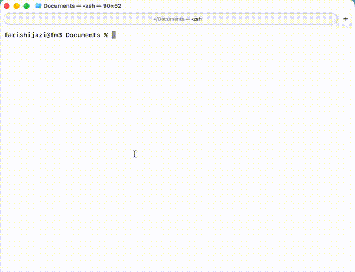

You can finally take your `claude code` history with you when you move/rename projects folders!  


Normally, your history is stored based on the project path, if you rename it you lose the ability to `--resume` or `--continue`.  
This tool copies the history from claude's internal files in `~/.claude/projects/...`.




## Quick start (/slash command)

1. Install the `/migrate` slash command (one-time):

```bash
# install `uv` and `uvx` if you haven't already
# curl -LsSf https://astral.sh/uv/install.sh | sh
uvx claude-migrate install-slash-command
```

2. Then inside Claude Code in the old location:

```
/migrate /new/path
```

3. Create the new path `cp -r /old/path /new/path` (this can either be done before or after step 2)

## CLI Usage

```bash
# Preview what would happen
uvx claude-migrate cp /old/path /new/path

# Move history (copy + delete old)
uvx claude-migrate mv /old/path /new/path

# Then continue at the new location
cd /new/path && claude --continue
```

### Quick tip

Using the CLI inside Claude Code with the `!` prefix (no AI overhead):

```
! uvx claude-migrate cp "$(pwd)" /new/path
```

## Commands

| Command | Description |
|---------|-------------|
| `cp <old> <new>` | Copy history (keeps original) |
| `mv <old> <new>` | Move history (removes original) |
| `rm <path>` | Remove history for a directory |
| `install-slash-command` | Install the `/migrate` slash command |

All commands support `--dry-run` / `-n`.

## How it works

1. Claude Code encodes project paths by replacing `/` and `.` with `-` (e.g. `/home/user/project` -> `-home-user-project`)
2. History lives at `~/.claude/projects/<encoded-path>/` as JSONL files
3. `cp`/`mv` copies the history directory to the new encoded path
4. Appends a user message to the latest session noting the path change, so Claude knows files moved

## Reference

Based on: https://gist.github.com/gwpl/e0b78a711b4a6a2fc4b594c9b9fa2c4c
